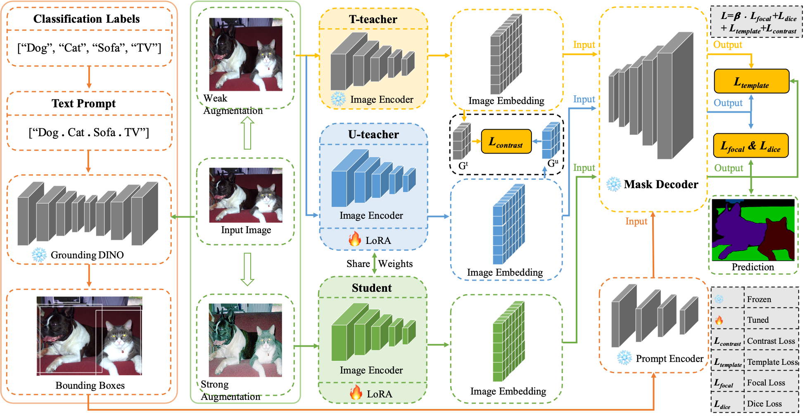

# Co2SAM
Implementation of the paper: "Co2SAM: Exploring Co-occurrence Challenges with SAM in Weakly Supervised Semantic Segmentation"

<p align="left"></p>

## Abstract
Weakly supervised semantic segmentation builds a semantic segmentation model with only image-level annotations, which provide only categorical information without localization details.
This limitation leads to persistent challenges related to class co-occurrence. Traditional methods often address this issue by incorporating external data or employing data augmentation techniques.  In contrast, we benefit from the large and diverse amount of data seen during SAM pre-training to exploit its potential recognition ability and solve the class co-occurrence problem with only the pre-trained model. Furthermore, existing SAM-based methods typically adopt SAM to produce pseudo-labels, which are then employed to train separate segmentation networks without employing SAM as a backbone for direct segmentation with image-level labels.
In addition, we found that although the SAM-based approach can solve the class co-occurrence problem, it still suffers from full target leakage.
Based on these observations, we propose a one-stage, dual-teachers-one-student network architecture, termed Co2SAM. Specifically, we utilize focal loss, contrast loss, dice loss, and template loss, and fine-tune the image encoder with LoRA. Experimental results substantiate the effectiveness of our Co2SAM.
The code is available at https://github.com/chunmengliu666/Co2SAM.

## Prerequisite

#### 1. install dependencies 
Ubuntu 18.04, CUDA 11.4, Python 3.8, and the following Python dependencies.

```pip install -r ./code_ms_coco_2014/requirements.txt```

#### 2. Download dataset 
Download [the PASCAL VOC 2012 development kit](http://host.robots.ox.ac.uk/pascal/VOC/voc2012).

#### 3. Download pre-trained weights and put them under the folder "./code_pascal_voc_2012/checkpoints" or "./code_ms_coco_2014/checkpoints"
Download [groundingdino_swint_ogc.pth](https://drive.google.com/file/d/1iom_nV2_sqTmMswhZt9nPsvvoNSrO60X/view?usp=sharing).

Download [sam_vit_b_01ec64.pth](https://drive.google.com/file/d/1Z-Smk9uSNbqrJaLmsYfK3Ia50Pg2N9CA/view?usp=sharing).

Download [sam_vit_h_4b8939.pth](https://drive.google.com/file/d/1E2rBxK-GN1RiD-qBaYeypIGEcrM6gogw/view?usp=sharing).


## Usage

#### 1. cd code_pascal_voc_2012, Run the run.sh script for training Co2SAM on PASCAL VOC 2012 dataset

```bash run.sh```

#### 2. cd code_ms_coco_2014, Run the run.sh script for training Co2SAM on MS COCO 2014 dataset
```bash run.sh```


## Testing

#### Download our trained weights
| Stage       |  Google drive | mIoU (%) |
|--------------|--------------|--------------|
| PASCAL VOC 2012 |  [Weights](https://drive.google.com/file/d/1bdV-F2jyVHVP34stlP2NX0FNYShOHlPK/view?usp=sharing)  | 81.1 |
| MS COCO 2014 |  [Weights](https://drive.google.com/file/d/1zzefJknfSukmtfyqHJeFLKoVL5NnX0K6/view?usp=sharing)  | 62.7 |


## Acknowledgements
This code is borrowed from [detectron2](https://github.com/facebookresearch/detectron2), [GroundingDINO](https://github.com/IDEA-Research/GroundingDINO), and [segment_anything](https://github.com/facebookresearch/segment-anything).
